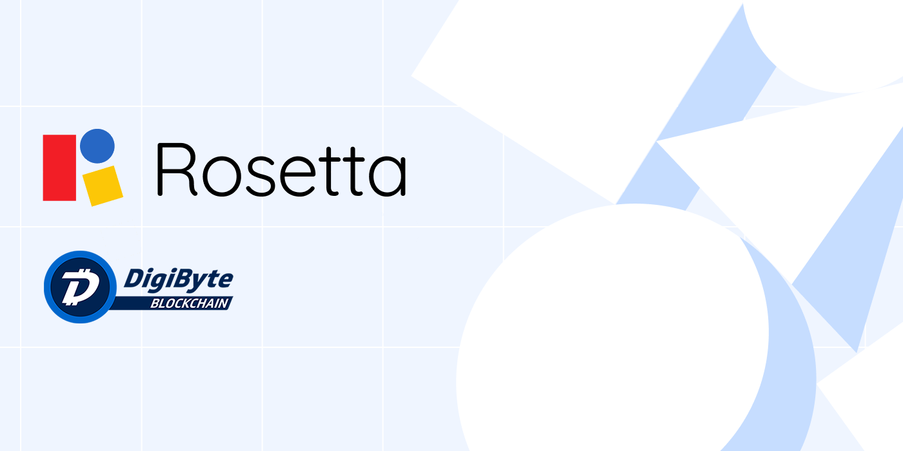

<p align="center">
  <a href="https://www.rosetta-api.org">
    
  </a>
</p>
<h3 align="center">
   DigiByte Rosetta Server (beta)
</h3>
<p align="center">
DigiByte Rosetta Node offering a unified API according to the standard proposed by Coinbase.
</p>

> This implementation is a Proof-of-Concept implementation for the [NodeJS Rosetta SDK](https://github.com/SmartArray/digibyte-rosetta-nodeapi/tree/1.4.1) developed by DigiByte

## Prerequisites
1. Install docker and git for your system

## Docker Build Steps
1. Clone the container using git
```bash
git clone https://github.com/SmartArray/digibyte-rosetta-server.git
```
2. Build the docker container
```bash
# Build the docker container for testnet (may take a while).
# Other build args are documented in ./Dockerfile
cd digibyte-rosetta-server
docker build -t digibyte/rosetta:latest --build-arg use_testnet=1 .
```
3. Start the docker container
```bash
# This command will start the docker container.
# In this example, docker will forward two ports: 8080, and 12026.
# Port 8080/tcp is the port of the rosetta api server.
# Port 12026/tcp is the p2p testnet port.
# If you are using mainnet, make sure you replace the port 12026 with 12024.
docker run -p 12026:12026 -p 8080:8080 digibyte/rosetta:latest
```

## Test
Run `npm run test` in order to run js unit tests.
Run `npm run test-api` in order to test the data api and construction api in an online/offline environment built with docker-compose.

Several example requests to test the reachability of your node using curl are shown in this document: [Example Requests](./docs/ExampleRequests.md).
An example on how to validate a mainnet account balance is shown here: [Validation](./docs/Validation.md)

## Current State
Currently, only the [Rosetta Data API](https://www.rosetta-api.org/docs/data_api_introduction.html) is implemented by this node. The Construction API will be completed soon.

## Implementation Details
This node implementation is using the experimental [Rosetta Node SDK](https://github.com/SmartArray/digibyte-rosetta-nodeapi/tree/1.4.1).

A UTXO-Indexing Middleware was implemented to enable balance lookups. Historical balance lookups are supported as well.
By using the `Syncer` class of the Rosetta SDK, the sync has become exceptionally reliable and even reorgs are supported very well. LevelDB (the same database that is being used in Bitcoin and its forks) is used to store the UTXO data. A space efficient encoding was chosen in order to avoid redundancy and to save some disk space (usage: 6.7G, as of 08th September, 2020).

- [x] Fast, reliable sync
- [x] Space efficient, non-redundant implementation
- [x] Tested with addresses that have more than 399k transactions (historical balance calculation may take several seconds for these accounts)
- [x] Balances are subtracted and UTXOs removed on reorgs (which happen several times a day)

Note, that the addition of an UTXO database is heavily discussed in the official Bitcoin Mailgroup. As soon as this feature is added, many altcoins will probably apply the changes too, and the above UTXO middleware will most likely become obsolete.

## ToDos
- [ ] Implement Construction API for Offline and Online Environments
- [x] Test the node using coinbase's [rosetta-cli](https://github.com/coinbase/rosetta-cli.git) ([Results](docs/LivenetValidationResults.md))
- [x] Run the mainnet node and wait for full sync
- [x] Test some utxo balance checks ([Results](docs/Validation.md))
- [ ] Setup Continious Integration
