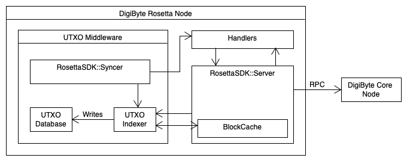

# UTXO Indexer Middleware

## Architecture

### Components
- `BlockCache`: Caches up to 250 blocks that were received through the rpc interface. [syncBlockCache.js](../src/syncBlockCache.js) is a singleton instance for the Blockcache
- `RosettaSDK::Syncer`: A `Syncer` class instance of the Rosetta Node SDK. Check this out: [RosettaNodeSDK/index.js](https://github.com/SmartArray/digibyte-rosetta-nodeapi/tree/1.4.1/lib/syncer)
- `Handlers`: Implementations of endpoint handlers following the Rosetta Specification. The official rosetta spec can be viewed here: [Data API - Overview](https://www.rosetta-api.org/docs/data_api_introduction.html)
- `RosettaSDK::Server`: A `Server` class instance of the Rosetta Node SDK. The class can be viewed [here](https://github.com/SmartArray/digibyte-rosetta-nodeapi/blob/1.4.1/lib/server/index.js). For each endpoint a handler must be registered as seen [here](https://github.com/SmartArray/digibyte-rosetta-server/blob/077a5b8ba5f72043c6a34209c80614df1e260489/index.js#L60)
- `DigiByte Core Node`: Official DigiByte Core Node
- `UTXO Indexer`: Parses the blocks that were received via the RPC interface. Extracts and indexes UTXOs and addresses. Writes its indexed data into the `UTXO Database`
- `UTXO Database`: A `LevelDB` KV instance with logical prefix keys ([shown here](https://github.com/SmartArray/digibyte-rosetta-server/blob/077a5b8ba5f72043c6a34209c80614df1e260489/src/Indexer.js#L41)). All written data, consisting of keys and values, is using compressed binary encoding in order to save a lot of space. For every block, transaction identifier and address there exists a symbol, that is represented with an integer, resulting in a very small database size.

### Data Flow
Since the `RosettaSDK::Syncer` class only works with Rosetta Nodes, we applied a little trick here. The syncer instance fetches blocks from the Rosetta SDK Server instance within this node implementation.
Of course, the instance of `UTXO Indexer` could also contact the `DigiByte Core Node` directly. Since the sync logic is quite the same, it would be redundant to implement it again.
The syncer emits events to the indexer, such as `BLOCK_ADDED` and `BLOCK_REMOVED`.
The `/block` endpoint handler (one of the `Handlers`) caches the RPC blocks into the `BlockCache` instance so that the `UTXO Indexer` instance can retrieve those later. Storing the RPC blocks is necessary, since UTXOs are not included in the response of the `/block` endpoint, but the indexer needs to have access to those.

The `UTXO Indexer` extracts the information from the RPC blocks, encodes them to binary and makes them accessible.
